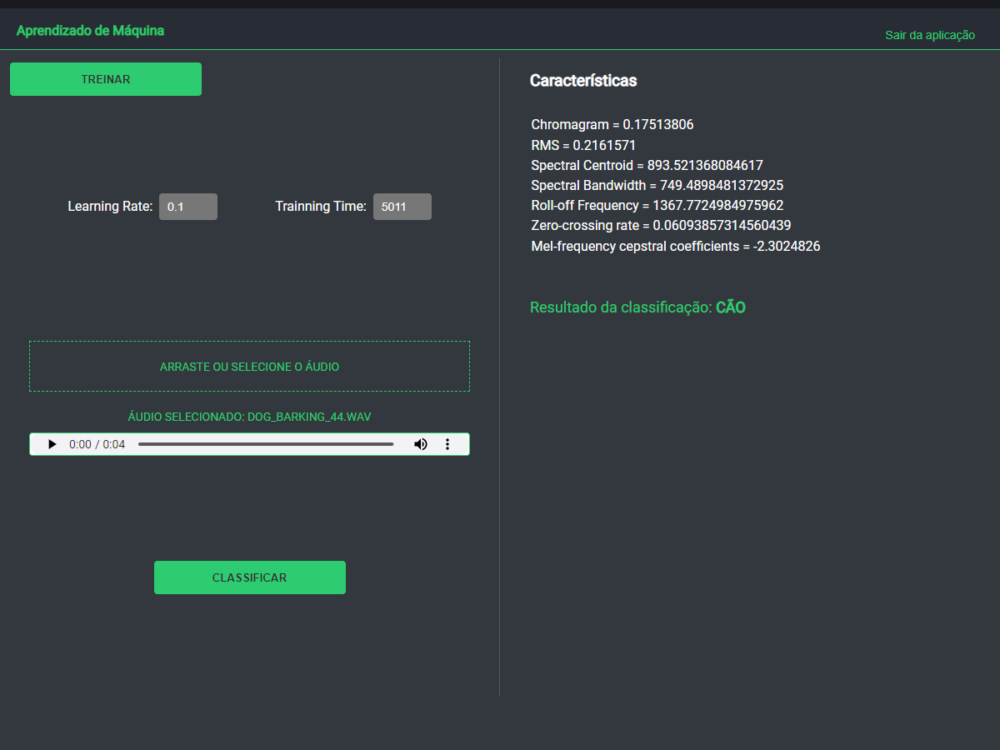
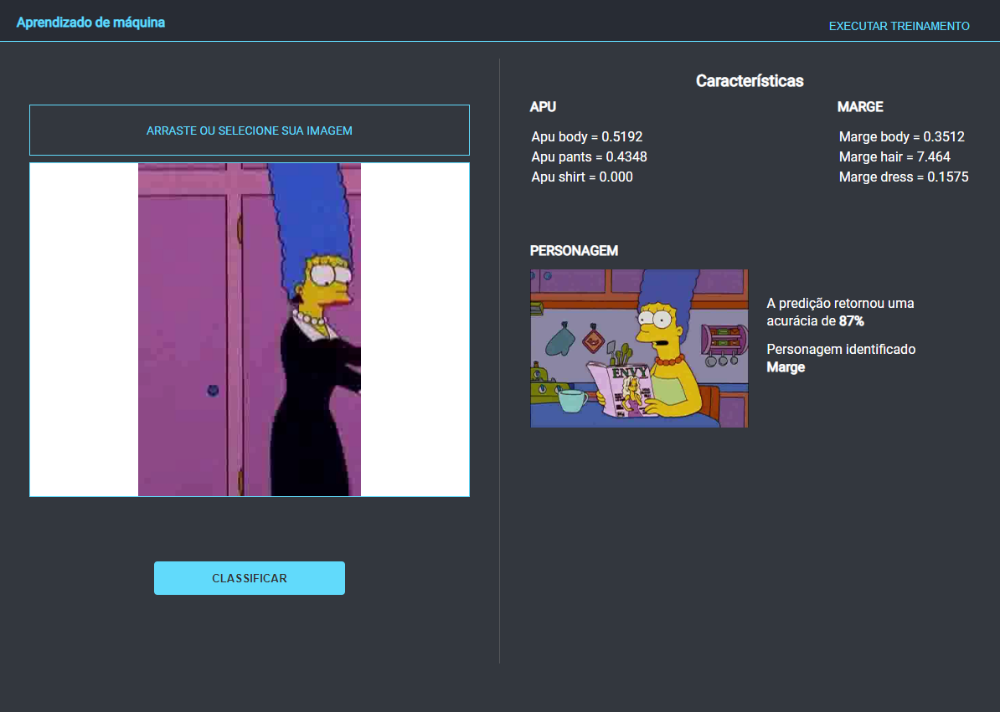

# Aprendizado de máquina

Esta aplicação utiliza Python para o processamento dos treinamentos, Electron + ReactJS para a aplicação desktop e frontend.

A comunicação entre Python e Electron ocorre via eventos através de uma bridge com a utilização de `IpcMain` e `IpcRenderer`.

Trabalho 2 - Treinamento e classificação de áudio

 

Extração de características de áudio, utilizando dataset com cachorros e gatos. É realizado o treinamento extraindo algumas características dos arquivos de treinamento e populando um `.csv` com as informações obtidas para posterior classificação baseada em determinado arquivo.

## Características extraídas

- [`chroma_stft`](https://librosa.org/doc/latest/generated/librosa.feature.chroma_stft.html) - Calcula um cromagrama de uma forma de onda ou espectrograma de potência
- [`RMS (Root Mean Square) ou raiz quadrática média`](https://librosa.org/doc/latest/generated/librosa.feature.rms.html) - Calcula o valor de "RMS" para cada quadro, seja a partir das amostras de áudio ou de um espectrograma
- [`spectral_centroid`](https://librosa.org/doc/latest/generated/librosa.feature.spectral_centroid.html) - Cada quadro de um espectrograma de magnitude é normalizado e tratado como uma distribuição sobre caixas de frequência, a partir da qual a média (centroid) é extraída por quadro
- [`spectral_bandwidth`](https://librosa.org/doc/latest/generated/librosa.feature.spectral_bandwidth.html) - A largura de banda espectral é definida como a largura de banda da luz na metade do pico máximo
- [`spectral_rolloff`](https://librosa.org/doc/latest/generated/librosa.feature.spectral_rolloff.html) - A frequência de rolagem é definida para cada quadro como a frequência central para uma caixa de espectrograma de tal forma que pelo menos roll_percent (0,85 por padrão) da energia do espectro neste quadro está contida nesta lixeira e nas lixeiras abaixo. Isso pode ser usado para, por exemplo, aproximar a frequência máxima (ou mínima) estabelecendo roll_percent a um valor próximo a 1 (ou 0)
- [`zero_crossing_rate`](https://librosa.org/doc/latest/generated/librosa.feature.zero_crossing_rate.html) - A taxa de cruzamento de zero é a taxa de alteração de sinal ao longo de um sinal, ou seja, a taxa na qual o sinal muda de positivo para zero para negativo ou de negativo a zero para positivo.
- [`mfcc`](https://librosa.org/doc/latest/generated/librosa.feature.mfcc.html) - Cepstro de frequência de mel é uma representação do espectro de potência de curto prazo de um som, com base em uma transformação de cosseno linear de um espectro de potência de log em uma escala de frequência de mel não linear.

## Utilização

- Abra o programa.
- Já existe uma base de treinamento por padrão, basta selecionar um áudio e clicar em classificar para obter resultados.

**Ao clicar em treinar a base predefinida será sobrescrita!**

> A acurácia da base de treinamento predefinida foi de 95%

-----

Trabalho 1 - Treinamento e classificação de imagens

Veja [a tag v1.1.0, para Trabalho 1](https://github.com/tiagoboeing/machine-learning/tree/v1.1.1)

