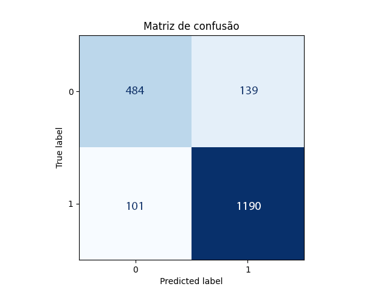

# Aprendizado de máquina

Esta aplicação utiliza Python para o processamento dos treinamentos, Electron + ReactJS para a aplicação desktop e frontend.

A comunicação entre Python e Electron ocorre via eventos através de uma bridge com a utilização de `IpcMain` e `IpcRenderer`.

Treinamento e classificação de imagens

## Informações

### Utilização

Caso desejar apenas classificar as imagens não clique em **executar treinamento** ao abrir o programa, consta no cache da aplicação o último treinamento, realizado com todas as imagens. Apenas treine novamente se realmente desejar.

**Já existe um arquivo de classificação onde o treinamento foi realizado com todas as imagens de ambos os personagens.** Basta testar com uma imagem externa e classificar.

> Ao executar o programa será possível realizar o treinamento com todo o dataset (**este processo pode levar horas**) ~ 2 horas. Ao finalizar o treinamento será exibida a matriz de confusão.

### Utilizando arquivo de teste

Caso tenha treinado acidentalmente e cancelado os dados para classificação serão sobrescritos. Na pasta [python/_backup_training](python/_backup_training) constam os arquivos para utilizar na aplicação caso necessário.

Copie:

- data.h5 e labels.h5 → `resources/python/output`

### Personagens escolhidos

- Apu Nahasapeemapetilon
- Marge Simpson

<table width="100%">
<tr>
  <td></td>
  <td></td>
</tr>
<tr>
  <td>Apu Nahasapeemapetilon</td>
  <td>Marge Simpson</td>
</tr>
</table>

### Características analisadas

#### Apu Nahasapeemapetilon

- Cor da pele
- Cor da jaqueta/camiseta
- Cor da calça

#### Marge Simpson

- Cor da pele
- Cor do cabelo
- Cor do vestido

### Extraindo características

A análise é baseada em cores com a aplicação de uma tolerância para cada um dos personagens e característica desejada. Na tabela abaixo o processo de extração de características para da Marge onde a cada etapa o range de cores estava sendo calibrado.

<table width="100%">
  <tr>
    <td>
      
    </td>
    <td>
      
    </td>
    <td>
      
    </td>
  </tr>
</table>

#### Range de cores

<table width="100%">
  <thead>
    <th colspan="12">Apu Nahasapeemapetilon</th>
  </thead>
  <tr>
    <th colspan="4">Cor da pele</th>
    <th></th>
    <th colspan="3">Cor da calça</th>
    <th></th>
    <th colspan="3">Cor da camisa</th>
  </tr>
  <tr>
    <td>R</td>
    <td>145</td>
    <td>100</td>
    <td>200</td>
    <td></td>
    <td>202</td>
    <td>189</td>
    <td>200</td>
    <td></td>
    <td>36</td>
    <td>28</td>
    <td>60</td>
  </tr>
  <tr>
    <td>G</td>
    <td>66</td>
    <td>30</td>
    <td>130</td>
    <td></td>
    <td>189</td>
    <td>175</td>
    <td>210</td>
    <td></td>
    <td>104</td>
    <td>95</td>
    <td>150</td>
  </tr>
  <tr>
    <td>B</td>
    <td>35</td>
    <td>0</td>
    <td>50</td>
    <td></td>
    <td>137</td>
    <td>119</td>
    <td>200</td>
    <td></td>
    <td>17</td>
    <td>0</td>
    <td>35</td>
  </tr>
    <tr>
    <td>
    </td>
    <td>
      
    </td>
    <td align="center">
      
    </td>
    <td></td>
    <td>
    </td>
    <td>
      
    </td>
    <td align="center">
      
    </td>
    <td></td>
    <td>
    </td>
    <td>
      
    </td>
    <td align="center">
      
    </td>
    <td></td>
  </tr>
  <tr>
    <td></td>
    <td>Alvo</td>
    <td colspan="2" align="center">Range</td>
    <td></td>
    <td>Alvo</td>
    <td colspan="2" align="center">Range</td>
    <td></td>
    <td>Alvo</td>
    <td colspan="2" align="center">Range</td>
  </tr>

  <tr>
  <td colspan="12"></td>
  </tr>

  <thead>
    <th colspan="12">Marge Simpson</th>
  </thead>
   <tr>
    <th colspan="4">Cor da pele</th>
    <th></th>
    <th colspan="3">Cor do cabelo</th>
    <th></th>
    <th colspan="3">Cor do vestido</th>
  </tr>
  <tr>
    <td>R</td>
    <td>205</td>
    <td>202</td>
    <td>235</td>
    <td></td>
    <td>65</td>
    <td>80</td>
    <td>40</td>
    <td></td>
    <td>142</td>
    <td>105</td>
    <td>166</td>
  </tr>
  <tr>
    <td>G</td>
    <td>171</td>
    <td>158</td>
    <td>195</td>
    <td></td>
    <td>85</td>
    <td>79</td>
    <td>110</td>
    <td></td>
    <td>171</td>
    <td>135</td>
    <td>215</td>
  </tr>
  <tr>
    <td>B</td>
    <td>11</td>
    <td>0</td>
    <td>50</td>
    <td></td>
    <td>253</td>
    <td>145</td>
    <td>255</td>
    <td></td>
    <td>91</td>
    <td>0</td>
    <td>123</td>
  </tr>
  <tr>
    <td>
    </td>
    <td>
      
    </td>
    <td align="center">
      
    </td>
    <td></td>
    <td>
    </td>
    <td>
      
    </td>
    <td align="center">
      
    </td>
    <td></td>
    <td>
    </td>
    <td>
      
    </td>
    <td align="center">
      
    </td>
    <td></td>
  </tr>
  <tr>
    <td></td>
    <td>Alvo</td>
    <td colspan="2" align="center">Range</td>
    <td></td>
    <td>Alvo</td>
    <td colspan="2" align="center">Range</td>
    <td></td>
    <td>Alvo</td>
    <td colspan="2" align="center">Range</td>
  </tr>
</table>

## Análise dos resultados

O processo de treinamento utilizando um dataset com 1914 imagens de Apu e Marge levou aproximadamente 1h 20min em um i7 8700K 4.7GHz + 48GB RAM.

### Matriz de confusão

A seguinte matriz de confusão foi obtida após o treinamento utilizando todo o dataset. Os dados identificam a quantidade de falsos positivos, por exemplo.

|       | Apu        | Marge       |
| ----- | ---------- | ----------- |
| Apu   | 484 `(TP)` | 139 `(FP)`  |
| Marge | 101 `(FN)` | 1190 `(TN)` |

> Apu = 0.0 ; Marge = 1.0

Análise dos dados:

- 143 imagens do personagem Apu foram encontradas onde o esperado era Apu (verdadeiro positivo) e 423 imagens da Marge foram encontradas corretamente (verdadeiro negativo);
- 70 imagens foram encontradas como Marge, porém deveriam ser Apu (falso positivo) e 34 imagens de Apu foram encontradas, porém deveriam ser Marge (falso negativo).

